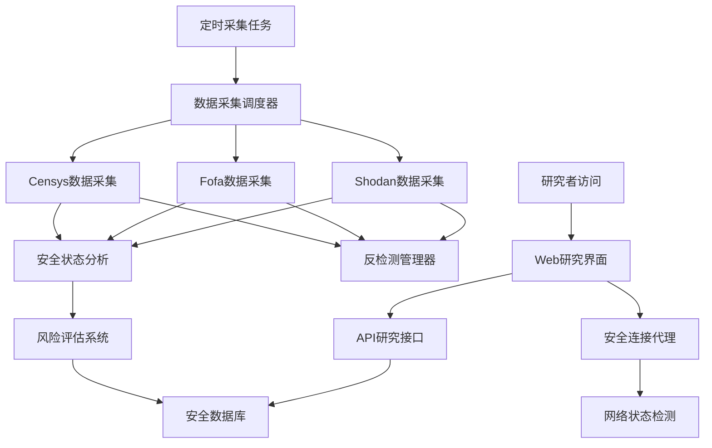

# 🔒 网络安全研究：JetBrains 许可服务器发现与分析

<p align="center">
  
  
  
  
</p>

<p align="center">
  <strong>🔬 研究演示：</strong> <a href="https://jetbrains.asiones.com">jetbrains.asiones.com</a><br>
  <strong>📦 开源项目：</strong> <a href="https://github.com/asionesjia/jetbrains">GitHub Repository</a><br>
  <strong>📚 研究性质：</strong> 仅供网络安全研究和学术分析使用
</p>

---

## 📖 研究概述

本项目是一个**网络安全研究项目**，旨在研究和分析互联网上暴露的软件许可服务器的分布情况、安全状态和网络拓扑结构。通过集成多个网络空间搜索引擎（Shodan、Fofa、Censys），自动发现、分析和监控全球范围内的 JetBrains 许可服务器，为网络安全研究提供数据支持。

**⚠️ 重要说明：本项目纯属学术研究，不提供任何商业服务，不鼓励任何违法违规行为。**

### ✨ 研究特性

- 🔍 **网络空间映射**：集成 Shodan、Fofa、Censys 进行网络资产发现研究
- 📊 **安全态势分析**：基于可用性动态评分，分析服务器安全状态
- ⚡ **实时监控研究**：研究网络服务的实时状态变化
- 🎯 **分布式系统研究**：分析全球许可服务器的地理分布
- 🔐 **会话管理研究**：研究网络爬虫的反检测技术
- 📱 **Web安全研究**：研究现代Web应用的安全架构
- 🚀 **云原生安全**：基于 Serverless 架构的安全研究平台

### 🎯 研究目标

1. **网络资产发现**：研究如何高效发现和分类网络中的软件服务
2. **安全状态评估**：开发自动化的服务器安全状态评估方法
3. **反检测技术**：研究网络爬虫的隐蔽性和反检测机制  
4. **分布式监控**：探索大规模网络服务监控的技术方案
5. **数据可视化**：研究网络安全数据的可视化展示方法

---

## 🏗️ 研究系统架构

本研究项目采用现代化的微服务架构，用于网络安全数据的采集、分析和可视化：



---

## 🛠️ 技术栈

### 后端技术
- **Next.js 14** - 全栈 React 框架
- **TypeScript** - 类型安全的 JavaScript
- **Supabase** - 开源 Firebase 替代方案
- **Vercel** - 无服务器部署平台

### 前端技术
- **React 18** - 用户界面库
- **Tailwind CSS** - 实用优先的 CSS 框架
- **Radix UI** - 无样式组件库

### 外部集成
- **Shodan API** - 网络设备搜索引擎
- **Fofa API** - 网络空间搜索引擎
- **Censys API** - 互联网扫描平台

---

## 📂 项目结构

```
jetbrains/
├── app/
│   ├── api/                    # API 路由
│   │   ├── cron/              # 定时任务
│   │   ├── oneCopy/           # 服务器代理
│   │   ├── proxy/             # CORS 代理
│   │   └── updateJetbrains/   # 状态更新
│   ├── globals.css            # 全局样式
│   ├── layout.tsx             # 根布局
│   └── page.tsx               # 主页面
├── components/                # React 组件
│   └── ui/                    # UI 组件库
├── lib/
│   ├── scanners/              # 扫描器实现
│   │   ├── shodan.ts          # Shodan 扫描器
│   │   ├── fofa.ts            # Fofa 扫描器
│   │   └── censys.ts          # Censys 扫描器
│   ├── utils/                 # 工具函数
│   │   ├── cookies-manager.ts # Cookie 管理
│   │   └── header-generator.ts# 请求头生成
│   └── jetbrains-scanner.ts   # 主扫描器
├── utils/supabase/            # Supabase 配置
├── schema.sql                 # 数据库架构
├── types_db.ts                # 数据库类型定义
└── vercel.json                # Vercel 配置
```

---

## 🗄️ 数据库架构

### `jetbrains` 表
| 字段 | 类型 | 描述 |
|------|------|------|
| `id` | SERIAL | 主键 |
| `url` | TEXT | 服务器 URL |
| `availability` | INTEGER | 可用性评分 (初始值: 100) |
| `created_at` | TIMESTAMP | 创建时间 |
| `updated_at` | TIMESTAMP | 更新时间 |

### `cookies` 表
| 字段 | 类型 | 描述 |
|------|------|------|
| `id` | UUID | 主键 |
| `platform` | TEXT | 平台名称 (shodan/fofa/censys) |
| `cookies` | TEXT | Cookie 字符串 |
| `created_at` | TIMESTAMP | 创建时间 |

---

## 🔧 研究API接口

### 网络资产发现接口
```http
GET /api/oneCopy
```
**研究用途：** 随机获取研究样本，用于分析许可服务器的分布特征

**响应示例：**
```json
{
  "message": "http://research.example.com:8080",
  "id": 123,
  "research_note": "仅供安全研究分析"
}
```

### 安全状态更新接口
```http
GET /api/updateJetbrains?id=123&status=1
```

**研究用途：** 收集服务器可用性数据，用于安全态势分析

**参数说明：**
- `id`: 服务器研究样本ID
- `status`: 安全状态 (`1` = 可达, `0` = 不可达)

### 数据采集触发接口
```http
GET /api/updateJetbrains?status=update
```

**研究用途：** 手动触发数据采集任务，用于研究数据更新机制

### 服务器移除接口
```http
GET /api/updateJetbrains?url=TARGET_URL&action=delete
```

**研究用途：** 允许服务器管理员从研究数据库中移除其服务器记录

**响应示例：**
```json
{
  "success": true,
  "message": "删除成功",
  "deletedCount": 1
}
```

### 安全连接代理
```http
GET /api/proxy?url=http://example.com
```

**研究用途：** 安全地测试目标服务器连通性，避免直接暴露研究者IP

### 删除申请表单
```
访问: /remove
```

**研究用途：** 为服务器管理员提供友好的Web界面，申请移除服务器记录

---

## ⚙️ 环境配置

### 必需的环境变量

```bash
# Supabase 配置
NEXT_PUBLIC_SUPABASE_URL=your_supabase_url
NEXT_PUBLIC_SUPABASE_ANON_KEY=your_supabase_anon_key

# 扫描平台凭据
SHODAN_USERNAME=your_shodan_username
SHODAN_PASSWORD=your_shodan_password
FOFA_USERNAME=your_fofa_username
FOFA_PASSWORD=your_fofa_password
CENSYS_USERNAME=your_censys_username
CENSYS_PASSWORD=your_censys_password

# 功能开关
ENABLE_SHODAN_SCAN=true
ENABLE_FOFA_SCAN=true
ENABLE_CENSYS_SCAN=true

# 评分系统
INITIAL_AVAILABILITY_SCORE=100
```

---

## 🚀 部署指南

### 本地开发

1. **克隆仓库**
```bash
git clone https://github.com/asionesjia/jetbrains.git
cd jetbrains
```

2. **安装依赖**
```bash
pnpm install
```

3. **配置环境变量**
```bash
cp .env.example .env.local
# 编辑 .env.local 填入必要的配置信息
```

4. **初始化数据库**
```bash
# 在 Supabase 控制台中执行 schema.sql
```

5. **启动开发服务器**
```bash
pnpm dev
```

### Vercel 部署

1. **连接 GitHub 仓库**
   - 在 Vercel 控制台中导入项目

2. **配置环境变量**
   - 在 Vercel 项目设置中添加所有必需的环境变量

3. **设置构建命令**
```json
{
  "buildCommand": "pnpm build",
  "outputDirectory": ".next",
  "installCommand": "pnpm install"
}
```

4. **配置 Cron 任务**
   - Vercel 会自动根据 `vercel.json` 配置定时任务

---

## 🔄 研究工作流程

### 数据采集流程
1. **定时触发**：自动化任务定期执行网络资产发现
2. **多源采集**：并行从 Shodan、Fofa、Censys 获取研究数据
3. **数据清洗**：去重和标准化采集到的网络资产信息
4. **安全验证**：评估发现资产的安全状态和可达性
5. **数据存储**：将研究数据存入安全数据库进行分析

### 风险评估机制
- **初始评估**：新发现的资产获得基准安全评分
- **正向反馈**：可达性确认时提高安全评分
- **负向反馈**：连接失败时降低安全评分  
- **自动清理**：长期不可达的资产自动从研究数据集中移除

### 研究样本选择
采用加权随机算法，确保研究样本的代表性和多样性，避免采样偏差。

---

## 📱 研究界面

### 主要研究功能
- **样本获取**：获取随机研究样本进行分析
- **数据复制**：便于研究者进行进一步分析
- **连通性测试**：实时评估网络资产的可达性
- **状态反馈**：收集研究数据用于安全态势分析
- **响应式设计**：支持各种研究设备和环境

### 研究操作流程
1. 访问研究演示平台 [jetbrains.asiones.com](https://jetbrains.asiones.com)
2. 点击"获取研究样本"按钮
3. 系统随机提供网络资产样本
4. 进行网络安全状态分析
5. 反馈研究结果以完善数据集

---

## 🔐 安全研究考虑

### 研究伦理
- **学术目的**：严格限制在网络安全研究范围内
- **数据保护**：不收集或存储个人隐私信息
- **匿名化处理**：所有研究数据经过匿名化处理
- **访问控制**：研究接口实施适当的访问控制

---

## 📊 研究数据分析

### 关键研究指标
- **采集成功率**：各平台数据采集任务完成情况分析
- **资产发现数量**：网络空间中新发现的资产统计
- **安全状态分布**：网络资产安全评分的统计分析
- **地理分布研究**：全球网络资产的地理位置分析

### 研究日志记录
系统自动记录研究相关数据：
- 数据采集任务执行日志
- 网络资产状态变更记录
- 研究API调用统计分析
- 异常情况和错误分析

---

## 🤝 学术合作

### 如何参与研究
1. **Fork 研究项目**
2. **创建研究分支** (`git checkout -b research/NewMethod`)
3. **提交研究成果** (`git commit -m 'Add research on NetworkMapping'`)
4. **推送研究分支** (`git push origin research/NewMethod`)
5. **创建学术讨论** (Pull Request)

### 研究贡献领域
- 🔍 **网络资产发现**：改进资产发现算法
- 📊 **数据分析方法**：开发新的分析技术
- 📚 **学术文档**：完善研究文档和论文
- 🎨 **可视化研究**：改进数据可视化方法
- 🔧 **性能优化**：提升系统性能和稳定性
- 🌐 **国际化研究**：多语言环境下的安全研究

---

## 📝 学术研究声明

**🎓 重要学术声明：**

1. **纯学术研究**：本项目完全基于学术研究目的，专注于网络安全领域的科学研究
2. **教育用途**：仅用于网络安全教育、学术交流和技术研究
3. **合规研究**：严格遵守学术研究伦理和相关法律法规
4. **责任研究**：研究过程中不进行任何可能造成损害的行为
5. **开放科学**：支持开放科学原则，促进学术知识共享

**⚖️ 法律合规声明：**

本研究项目严格遵循以下原则：
- **被动观察**：仅进行网络空间的被动观察和分析
- **公开数据**：仅使用公开可获取的网络数据
- **学术免责**：研究者对项目的学术使用不承担商业责任
- **禁止滥用**：严禁将研究成果用于任何违法违规活动
- **持续改进**：根据法律法规变化持续改进研究合规性

**🔬 研究伦理承诺：**

我们承诺遵循最高标准的研究伦理：
- 尊重网络资源和服务提供者的权利
- 避免对网络服务造成不必要的负载
- 保护研究过程中发现的敏感信息
- 促进网络安全技术的正面发展
- 支持负责任的网络安全研究实践

## 🎓 Academic Purpose Disclaimer

**IMPORTANT ACADEMIC NOTICE:**

This project is developed and maintained solely for **ACADEMIC RESEARCH PURPOSES** in the field of cybersecurity. By using this software, you acknowledge and agree to the following terms:

### Academic Research Only
- This software is intended exclusively for educational, academic, and research purposes
- All usage must comply with academic research ethics and applicable laws
- Commercial use or any malicious activities are strictly prohibited
- Users must respect the rights of network resource providers

### Research Methodology
- The project employs only **passive observation** techniques
- All data sources are publicly available through legitimate search engines
- No active penetration testing or unauthorized access is performed
- Research follows responsible disclosure principles

### Limitation of Liability
- The authors and contributors provide this software "AS IS" without warranty
- Users assume full responsibility for their use of this research tool
- The project maintainers are not liable for any misuse or legal consequences
- This software should not be used for any unlawful purposes

### Ethical Compliance
- Respect network service providers' terms of service
- Avoid causing unnecessary load on target systems
- Protect sensitive information discovered during research
- Contribute positively to cybersecurity knowledge and practices

**If you disagree with these terms or cannot ensure academic and ethical use, please DO NOT use this software.**

For questions regarding academic use or ethical considerations, please contact us through [GitHub Issues](https://github.com/asionesjia/jetbrains/issues).

---

## 📞 学术联系

- **研究项目主页**：https://github.com/asionesjia/jetbrains
- **学术讨论**：[GitHub Issues](https://github.com/asionesjia/jetbrains/issues)
- **研究合作**：[GitHub Discussions](https://github.com/asionesjia/jetbrains/discussions)
- **演示平台**：https://jetbrains.asiones.com

---

## 📄 开源协议

本研究项目采用 [MIT License](LICENSE) 开源协议，支持学术研究和教育使用。

---

<p align="center">
  <strong>🔬 支持网络安全研究，请给个 ⭐ Star！</strong><br>
  <sub>Built with ❤️ for Cybersecurity Research by <a href="https://github.com/asionesjia">Security Researcher</a></sub>
</p>
